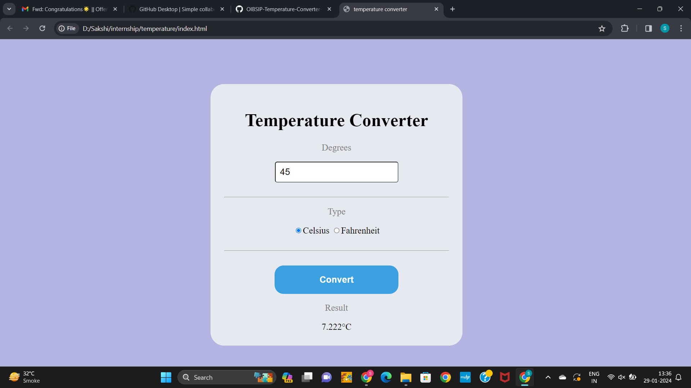

# OIBSIP-Temperature-Converter-Website
The temperature converter website is a user-friendly online tool designed to effortlessly convert temperatures between different units. The interface is intuitive, featuring input fields for users to enter a numerical value and select the desired unit for both the input and output temperatures, such as Celsius, Fahrenheit, or Kelvin.
The website dynamically displays the converted temperature instantly, allowing users to quickly and accurately obtain the equivalent value in their preferred temperature scale. 
 
<b>Preview</b>

